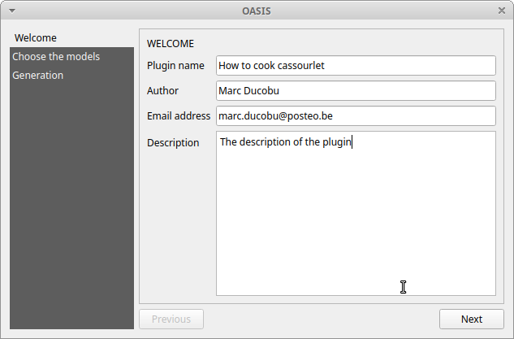
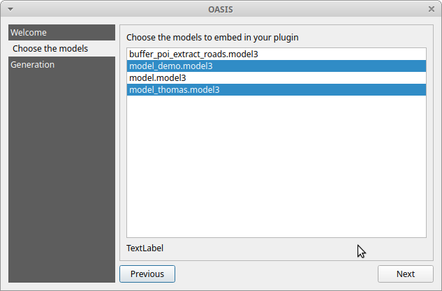
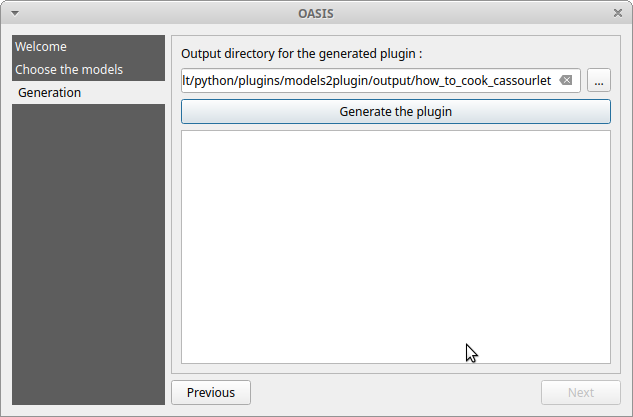

# Models2plugin - QGIS Plugin

 

Models2plugin helps you for generating a plugin which will add your models automatically in the Processing toolbox.

## Documentation

### How to generate a plugin using Models2plugin

Click on the action of the toolbar to open the main dialog of the plugin and fill the form.

Then choose the models you want to add in the plugin.

Finally, choose the output folder and click on the button "Generate the plugin". You wiil find your plugin in the output folder you specified.

### Description of the generated plugin

TBD

## License

Distributed under the terms of the [`MIT` license](LICENSE).

## Generated with QGIS Plugin Templater

The base code has been generated with [QGIS Plugin Templater](https://oslandia.gitlab.io/qgis/template-qgis-plugin).

### Options used to generate this project

| Cookiecutter option | Picked value |
| :------------------ | :----------: |
| Python linter | Ruff |
| CI/CD platform | GitHub |
| Publish to <https://plugins.qgis.org> using CI/CD | True |
| IDE | VSCode |
